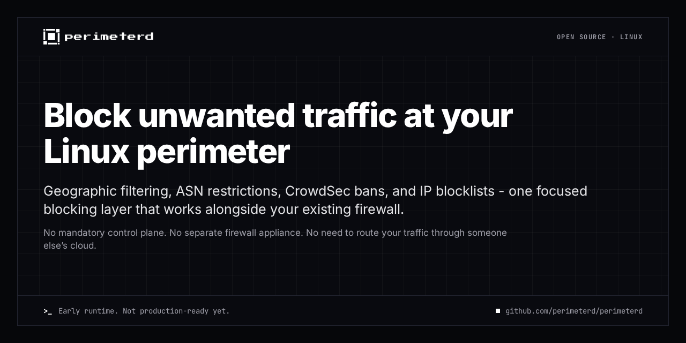

# perimeterd

`perimeterd` adds geographic/ASN policy, custom and provider IP lists, CrowdSec
ingress bans, and IP/CIDR allow/block overrides to an existing Linux firewall.
It filters unwanted ingress and egress traffic; the parent firewall remains
responsible for permitting services and ports.

> **Pre-release:** build and run from source. Installed service/package artifacts
> and production releases remain planned.
> **This is not yet a production-ready security control.**

The [implementation plan](docs/implementation-plan.md) tracks completed
milestones and remaining release gates.

## Try the configuration validator

Build with Go 1.27.1; automatic toolchain selection also works with an older Go:

```sh
GOTOOLCHAIN=auto make build
bin/perimeterd version
bin/perimeterd validate --config configs/perimeterd.yaml
```

Validation requires neither root nor network access. It checks local syntax and
semantics, not source availability or kernel enforcement. Root-only `run`,
`cleanup`, and daemon-backed [lookup](docs/operations.md#ipcidr-lookup) are
available for the [current runtime](docs/operations.md#current-source-build-runtime).
Try enforcement only in a disposable VM or isolated network namespace. See
[development](docs/development.md#local-commands) for verification commands.

## First-release contract

Version 1 targets Linux on `amd64` and `arm64`, with nftables or iptables/ipset,
RIPEstat-derived geographic/ASN policy, custom HTTP(S) text IP lists in policy
include/exclude selectors with per-list refresh intervals, direct provider IDs
resolved dynamically through jsDelivr, and CrowdSec ingress bans. Docker
coexistence, IP/CIDR lookup with source explanations, and
[optional OpenZiti transport](docs/architecture.md#optional-openziti-upstream-transport)
for selected CrowdSec/custom-list upstreams are implemented. Direct HTTP(S)
remains the default, with no Ziti prerequisite. Complete observability, systemd
packaging, and signed RPM/DEB releases remain planned.

The documents below own the detailed contracts. The implementation plan records
which parts are implemented; source-build commands do not imply installed
services or release artifacts.

## Documentation

Start with [operations](docs/operations.md#current-source-build-runtime) to try
enforcement, or [development](docs/development.md#local-commands) to build and
verify changes.

| Document | Canonical scope |
| --- | --- |
| [Implementation plan](docs/implementation-plan.md) | Milestone status, remaining gates, and next work |
| [Architecture](docs/architecture.md) | Component boundaries, writer ownership, revision admission, commit, recovery, and applied-state lookup |
| [Configuration](docs/configuration.md) | YAML schema, defaults, validation, policy semantics, and examples |
| [Data sources](docs/data-sources.md) | RIPEstat/cache contracts, HTTP(S) text lists, dynamic provider feeds, and CrowdSec wire compatibility, authority, projection, and leases |
| [Firewall backends](docs/firewall-backends.md) | Packet paths, native ownership, commit/rollback guarantees, and attachments |
| [Operations](docs/operations.md) | Source-build procedures, health/metrics, lookup CLI contract, and service/package lifecycle |
| [Development](docs/development.md) | Repository map, commands, verification matrix, measurements, CI, and release requirements |

Each contract has one owner. Other documents summarize it and link to that owner
rather than define a second algorithm.

## Design lineage and licensing

The existing [MIT license](LICENSE) is authoritative. The project takes
behavior-level inspiration from
[geoip-shell](https://github.com/friendly-bits/geoip-shell), whose GPL-3.0
source must not be copied into this MIT-licensed repository. The MIT-licensed
[CrowdSec firewall bouncer](https://github.com/crowdsecurity/cs-firewall-bouncer)
and [Go CrowdSec bouncer client](https://github.com/crowdsecurity/go-cs-bouncer)
may be reused subject to dependency review and preservation of required
copyright and license notices.
