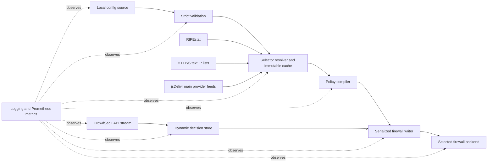
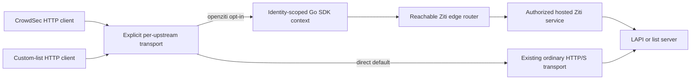
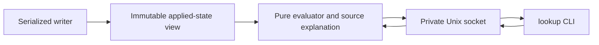

# Architecture

This document owns component boundaries, writer ownership, revision admission,
and durable recovery for the native runtimes, including custom HTTP(S) IP lists
and direct named-provider feeds through the static-source boundary. The
[lookup boundary](#read-only-lookup-and-explanation) explains applied state
without joining the writer or contacting sources.
[Optional OpenZiti upstream transport](#optional-openziti-upstream-transport)
connects selected LAPI/custom-list clients to private services. Service packaging
and [future deployment boundaries](#future-deployment-boundaries) remain unimplemented.

The [implementation plan](implementation-plan.md) owns milestone status.
[Operations](operations.md#current-source-build-runtime) describes what can run
from a source build today.

Related contracts live in [configuration](configuration.md),
[data sources](data-sources.md), [firewall backends](firewall-backends.md),
[operations](operations.md), and [development](development.md). The
[documentation map](../README.md#documentation) identifies each owner.

## System context and data flow

`perimeterd` is one foreground process with one serialized firewall writer.
Configuration parsing, network requests, prefix normalization, policy compilation,
and replacement-resource setup happen outside the apply critical section.
Completed static candidates and coalesced CrowdSec decision projections enter
the same writer.

Only the writer invokes backend mutations and native inspection. Backends
perform these operations under that ownership; source adapters never mutate
firewall or active-revision state. Logging and metrics observe the selected
revision but do not make policy decisions.

### Exclusive lifecycle ownership

Version 1 manages the host network namespace only, using the shared host
`/var/lib/perimeterd` state and `/run/perimeterd` runtime directories. Separate
mount views of those directories or multiple instances in that namespace are
unsupported; a different configuration path does not create a separate owner.
The native test harness isolates the whole process and its state in disposable
namespaces; the daemon does not manage multiple network namespaces.

Before reading mutable ownership state or invoking a backend, `run` and
`cleanup` acquire the same nonblocking exclusive `flock` on
`/run/perimeterd/owner.lock`. They hold its open file descriptor for their
entire lifetime, including recovery, child commands, and shutdown draining.
A conflict fails immediately. `validate` and `version` do not need the lock.
Direct invocations create the root-owned runtime directory and lock with modes
`0700` and `0600` when absent.

The lock file is never unlinked or replaced: a new inode would allow another
owner. Children finish before the owner releases it. The planned service/package
lifecycle must preserve this boundary across stops. This lock neither replaces
the host xtables lock nor coordinates unrelated firewall managers.

## Conceptual contracts

These are responsibility boundaries, not a prescription for additional Go
interfaces. [Development](development.md#current-repository-layout) maps them
to the current files.

| Boundary | Responsibility | Must not own |
| --- | --- | --- |
| Configuration | Read local YAML, validate and normalize it; admit reload requests through the app | Kernel mutation or remote-source resolution |
| Source resolution | Resolve required selectors into one immutable, validated snapshot and cache manifest | Partial policy publication or backend syntax |
| Upstream transport | Supply explicitly selected direct or identity/service-bound connections; bound application waits and own SDK contexts/HTTP pools subject to the documented SDK cleanup limitation | Source parsing, policy decisions, host-wide interception, automatic direct fallback, or firewall exceptions |
| Policy compilation | Purely compile normalized configuration and snapshots into immutable, backend-neutral rules, sets, and accounting roles | Network, filesystem, or kernel I/O |
| Application engine | Serialize admission, freshness checks, mutation, and transaction decisions | Native packet-filter syntax |
| Durable store | Validate and publish revision/journal records with explicit durability barriers | Choosing which attempted revision should win |
| Native backend | Preflight, apply, retire, and clean up exact owned targets; preserve native accounting objects | Fetching source data or selecting the durable active revision |
| Runtime publication | Publish the selected source snapshot, logger, and listener; retain or discard staged resources according to the selected transaction | Treating an uncertain commit as success |
| Lookup and explanation | Evaluate a coherent applied-state view and explain source membership through a private read-only daemon interface | Selecting candidates, contacting sources, native inspection, mutation, or claiming end-to-end reachability |

The current configuration ingress is a local file, reloaded with `SIGHUP`;
implemented static sources are RIPEstat, custom HTTP(S) lists, and dynamic
named-provider feeds. Any future configuration or prefix providers must
preserve these boundaries and produce complete candidates rather than bypass
admission or call a backend directly.

Static reconciliation remains separate from the incremental CrowdSec
path: individual decisions must not rebuild global or geo sets. Both paths use
the same writer. Each dynamic dispatch obtains one freshly validated durable
view for both active-target selection and prepared-journal checks. Views are not
retained across dispatches or failure retries; durable and source-cache
validation remain trust boundaries.

Kernel packet/byte accounting is implemented; periodic collection and Prometheus
export are planned. The collector must observe through the writer outside the
HTTP request path, never mutate policy, and never change readiness.
[Operations](operations.md#prometheus-metrics) owns collection cadence, failure
handling, and process-lifetime counter semantics.

### Custom IP list integration

Named `ip_lists` extend static source resolution, not the dynamic CrowdSec path.
Each definition supplies an HTTP(S) URL and its own refresh interval; policy
`include.ip_lists` and `exclude.ip_lists` reference those names. The
[configuration contract](configuration.md#custom-ip-lists) owns fields,
defaults, validation, and policy semantics; [data sources](data-sources.md#custom-https-ip-lists)
owns the text format, fetch limits, source identity, scheduling, and cache rules.

The resolver fetches only lists referenced by enabled policies, normalizes their
IPv4/IPv6 prefixes, and stages them alongside any required RIPEstat selectors
in one complete immutable snapshot. The compiler performs the existing
include-union minus exclude-union algebra without knowing URLs or making
requests. Both backends consume the resulting static sets; list refreshes do
not update live sets in place or create a new packet-path stage.

A single static scheduler accounts for RIPEstat and per-list deadlines.
Refreshes still carry the active configuration epoch and global static refresh
sequence; separate list timers must not publish independently or overwrite
another source's newer result. Reload stages list definitions and scheduling
with the rest of the candidate. Only durable selection activates the new
schedule; a rejected reload leaves the old definitions and refreshes running.

The existing writer, journal, recovery, and complete-snapshot fallback
boundaries apply unchanged. List URLs are part of source identity: changing a
URL cannot reuse the old endpoint's prefixes as fallback under the same name.
Persisted source evidence must remain sufficient to recover existing
RIPEstat-only revisions as well as mixed-source revisions.

### Named provider integration

The distinct `provider` selector/source kind implements
`include.providers` and `exclude.providers`, backed by the published merged
dual-stack TXT files in `rezmoss/cloud-provider-ip-addresses`. The
[configuration contract](configuration.md#named-providers) owns ID syntax
and timing defaults; [data sources](data-sources.md#named-provider-feeds)
owns the exact jsDelivr `@main` URL mapping, validation, and failure semantics.

There is no embedded provider catalog, release-pinned membership, user-defined
source map, or runtime inventory download. Configuration validation remains
offline and checks safe ID syntax only. The resolver determines existence by
fetching the required provider file; a syntactically valid unknown ID must fail
runtime resolution rather than silently disappear from the compiled policy.
Only enabled-policy references resolve, and a newly published provider needs no
binary update.

Reuse the existing HTTP transport, strict text parser, shared resource limits,
immutable source store, static scheduler, and serialized writer. Preserve
provider identity separately from custom-list names even when both use the
same spelling or URL. Do not introduce `go-cloudip`, its embedded database,
another background updater, or backend-specific fetching. The compiler remains
pure and treats provider prefix sets like other static selector sets.

The default follows mutable `main` through jsDelivr; this does not promise that
different provider downloads represent one upstream commit. The guarantee is a
complete, atomically selected local candidate. Unknown providers without exact
committed fallback prevent activation; failed refreshes retain the previous
complete revision and its retrieval evidence. Reloaded timing/reference changes
take effect only after durable selection, and rejected reloads retain old timers.
Existing RIPEstat and custom-list recovery evidence must remain readable.

### Optional OpenZiti upstream transport

The standard binary embeds
[OpenZiti Go SDK v1.8.2](https://github.com/openziti/sdk-golang/tree/v1.8.2)
as an optional runtime transport for `crowdsec.lapi_url` and individual custom
`ip_lists` sources. This is not a new policy selector, firewall backend,
listener, or source parser.
[Configuration](configuration.md#optional-openziti-configuration)
owns the fields; [data sources](data-sources.md#openziti-upstream-transport)
owns routing, HTTP/TLS, cache identity, and failure semantics;
[operations](operations.md#openziti-operations) owns provisioning.

The standard binary includes the pinned SDK, but omitted transport settings
preserve today's behavior. A direct-only deployment does not load identity
files, initialize SDK contexts, contact Ziti, or acquire another runtime
prerequisite. Unused identity profiles likewise remain inactive. Do not mutate
process-global HTTP transports, DNS, host routes, or network interfaces.
RIPEstat and fixed jsDelivr provider downloads retain their existing transport;
a private provider mirror can be configured as a custom list.

Each opted-in upstream names an identity profile and one exact Ziti service.
The application URL still supplies HTTP authority, path/query, and HTTPS
certificate verification; it is not the service name. Dial the service
explicitly, without application-host DNS, intercept discovery, or direct
fallback. An unavailable or unauthorized service fails that source attempt.
The host needs ordinary reachability to Ziti control/edge endpoints, but no
host tunneler, VPN interface, or route to the private application.

SDK contexts and HTTP pools are application-owned resources, outside the
serialized writer. Share a context only among users of the same loaded identity
generation; service-bound HTTP pools must not mix identities or destinations.
Only reference/selection swaps belong under writer ownership; SDK authentication,
network I/O, and potentially blocking close/drain work do not.
Required source work remains within existing caller request, startup, and
shutdown budgets. Admission precedes SDK worker creation; at most eight SDK
dials may remain in flight, with one per identity generation. Caller cancellation
does not imply SDK authentication has stopped: see the explicitly accepted
[SDK cancellation limitation](data-sources.md#sdk-cancellation-limitation).
SDK reconnect/service refresh does not become another source scheduler, LAPI
cursor consumer, or writer.

On startup or admitted reload, read only referenced identity profiles and
capture validated credential material as an immutable generation. Construct
replacement contexts/pools outside the apply critical section. Ordinary
refreshes use the selected generation, not whatever bytes later appear at its
file path. Replacement at the same path takes effect through `SIGHUP`, never
through an untracked file watch or SDK credential-file rewrite.
Loading credentials is a local check, not a requirement for successful network
authentication before reusing valid same-route committed static fallback.
Fresh fetches and CrowdSec synchronization still require live connectivity.

Stage affected static-source resolution and any replacement CrowdSec full
snapshot with the candidate. Even when its URL/API key is unchanged, a changed
CrowdSec transport or identity generation requires a new source epoch; preserve
the existing poller pause/resynchronization rules. Old clients, decision expiry,
and unaffected direct sources retain their existing authority until selection.
Rejected/stale candidates release only their own references and leave selected
contexts usable. Committed, rolled-back, and uncertain outcomes select or retain
transport resources through the existing runtime-publication/recovery boundary,
not a second commit mechanism. Retire pools and close a context only after its
last active, staged, pending-recovery, and in-flight reference is released.
Shutdown cancels application work and bounds context-close waits before lifecycle
ownership is released; it cannot guarantee drainage of SDK-internal workers.

Static evidence records the effective transport identity as well as URL/parser
identity. Recovery of already selected firewall state remains local: it must
not authenticate to Ziti or need a currently readable private key merely to
verify saved prefix evidence or perform `cleanup`. Source activation and new
CrowdSec synchronization still require their normal runtime prerequisites.
Never persist SDK sessions or credentials as recovery authority. Lookup remains
read-only and neither opens a context nor fetches a source.

This feature grants no policy exemption to perimeterd itself. Operators must
keep underlay control/edge connectivity available under egress policy; the SDK
must not add allow rules or bypass either native backend.

## Read-only lookup and explanation

**Status:** implemented by `internal/lookup` and the writer-owned publication
boundary in `internal/app/lookup.go`.
[Operations](operations.md#ipcidr-lookup) owns CLI input, output, and
verdict semantics; [data sources](data-sources.md#lookup-source-attribution)
owns attribution; [development](development.md#lookup-and-explanation)
owns acceptance coverage. No YAML fields or durable schema changes are required.

### Applied-state query view

An IP/CIDR lookup evaluates perimeterd's applied policy for new flows, not a
fresh compilation of the configuration file. Its inputs must be one immutable,
coherent view of:

- the selected revision, normalized configuration, compiled rules, family and
  attachment scopes, and exact selected static source manifest;
- the successfully applied CrowdSec projection, its client epoch and
  acknowledged operation watermark, supporting decision identities, and
  effective native lease evidence; and
- enforcement availability and a captured evaluation time.

A confirmed empty managed state is also queryable: identify absent revision or
manifest references explicitly and report the corresponding scopes as not
managed, rather than inventing an active target or treating emptiness as failure.

The desired CrowdSec store can be ahead of native application. Its newest
decisions are not evidence that a ban is enforced, nor does a desired deletion
prove that an old ban has already disappeared. Retain query provenance with
the acknowledged projection; discard it when that projection is superseded.
Decision deadlines and kernel lease deadlines are different. Evaluate known
lease coverage at the captured time, and report uncertainty if the available
evidence cannot establish coverage. Renewals can change query-visible lease
evidence without changing the durable revision or desired decision revision.
Never persist live decisions or leases to make offline lookup possible.

The writer owns publication and invalidation of this read model, using the
existing mutation/acknowledgment boundaries:

1. Candidate fetching/compilation leaves the current query view selected.
2. Before native mutation, invalidate definitive responses for the affected
   view. Queries must not label an in-flight iptables family switch, dynamic
   update, or backend migration as one settled generation.
3. Publish a replacement only after the required native acknowledgments,
   durable static selection, and retirement complete. Safe compensation can
   restore the previous view; uncertain commit, failed compensation, pending
   recovery, or unresolved old targets remain unavailable.
4. Capture immutable references under serialization, then evaluate outside the
   writer's critical section. Before returning a definitive response, verify
   that the captured publication token has not been invalidated; otherwise
   return unavailable rather than combine generations or retry indefinitely.

The response identifies its revision, source manifest, dynamic operation
identity where applicable, and `observed_at` instant. It is an as-of result,
not a promise that policy stays unchanged after the response. Missing source
evidence must not be silently replaced with newer cache objects. Known stale
static feeds remain explainable when their committed policy remains enforced;
report retrieval age rather than interpreting staleness as an empty set.

### Pure evaluator and provenance

Promote/reuse the semantics exercised by the existing test-only packet
evaluator as a production backend-neutral evaluator. Evaluate compiled rule
order, not just prefix membership, and preserve the existing
[evaluation contract](configuration.md#evaluation-semantics). Do not implement
separate nftables and iptables policy engines or reverse-parse generated rules
in the CLI.

For a CIDR, partition at relevant prefix boundaries; for omitted traffic
filters, partition at relevant protocol and port-scope boundaries. Evaluate
each resulting scope and coalesce only equivalent outcomes, retaining distinct
deciding reasons and attribution. Never enumerate IPv4 or IPv6 hosts, test only
the network address, or infer full coverage from one matching prefix.
Reuse immutable snapshots and existing prefix algebra; do not copy the entire
compiled state or every source feed for each query.

Attribution uses the selected configuration and exact source snapshot, plus
acknowledged dynamic evidence. It is a side explanation of the rule result,
not a second enforcement algorithm. Include/exclude matches and shadowed
memberships must not be presented as independently deciding rules.

### Private query transport and lifecycle

Use a separate HTTP-over-Unix-domain-socket endpoint, `POST /v1/lookup`, at
`/run/perimeterd/lookup.sock`. The request is a JSON object with required string
`address` and optional `direction`, `protocol`, and integer `port`, using the
operator contract's values and omission semantics. Reject unknown fields,
duplicate keys, invalid types, trailing JSON, and unsupported API versions.
`--json` controls CLI rendering, not query semantics. The endpoint returns the
versioned result described in [operations](operations.md#lookup-results-and-errors).
This is not exposed on the unauthenticated metrics listener or a TCP port.
The socket is root-owned mode `0600` inside the existing root-owned `0700`
runtime directory. Initial access is root-only; remote access, delegated group
access, arbitrary socket paths, and administrative mutation methods are outside
this feature.

`run` acquires the existing lifecycle lock before managing the socket. Only
that owner may remove a verified stale socket at the fixed path; a symlink,
non-socket, or unexpected owner is an error, not permission to unlink arbitrary
files. Bind before readiness, answer unavailable until a coherent view is
published, and keep the listener across configuration reloads. Failure to bind
prevents successful startup. On shutdown, stop admission and drain/cancel
queries before releasing ownership; remove only the socket inode this process
created. Never unlink or replace `owner.lock`.

The CLI connects without taking the lifecycle lock or opening the durable store.
Queries cannot fetch or refresh sources, read credentials, renew leases, enqueue
reconciliation, invoke backend inspection/mutation, reset counters, or change
readiness. A stopped daemon yields unavailable even if retained static rules
still exist. There is no implicit offline or configuration-file fallback.

Bound each request body to 4 KiB, each complete encoded response to 4 MiB, and
each query to 4,096 combined outcome/evidence records. Admit at most four
concurrent evaluations; excess requests fail busy rather than grow an unbounded
queue. Apply a five-second end-to-end client deadline and bounded server
read/evaluation/write deadlines, checking cancellation during partitioning and
attribution. A limit failure returns an explicit error, never a truncated
answer labeled complete. Encode within the response bound before sending a
successful result. Do not hold the writer while evaluating or waiting for a
slow client.

This interface describes the daemon's applied-policy view for traffic reaching
the reported managed attachment. It neither probes connectivity nor proves
that another firewall manager, routing/NAT, or an out-of-band kernel edit has
left that packet path intact. Detecting arbitrary external drift would require
a separate writer-owned observation design, not ad hoc inspection by queries.

## Revision lifecycle

### Commands

| Command | Lifecycle effect |
| --- | --- |
| `validate` | Parse, normalize, and validate local configuration; no source requests or firewall mutation |
| `version` | Report build metadata; no ownership or configuration requirement |
| `run` | Acquire ownership, recover durable state before reading current YAML, initialize required sources, reconcile and commit, then report readiness |
| `cleanup` | Acquire ownership and remove recorded owned targets using durable metadata, without consulting current YAML |
| `lookup` | Query the running owner's applied policy and source evidence; no lifecycle lock, source requests, durable-store access, or native commands |

`run` needs a complete static snapshot (fresh or acceptable committed cache) and
authoritative CrowdSec synchronization when enabled. The
[bounded startup protocol](operations.md#bounded-startup-deadline) covers
recovery and initialization. Explicit cleanup is for operator action after
stopping the daemon, or eventual final package removal. See
[operations](operations.md#operator-sequence) for commands and prerequisites.

### Signals and shutdown

`SIGHUP` stages a complete reload. `SIGTERM` stops watchers, refresh workers,
and the HTTP listener, drains or safely cancels in-flight work, and exits. It
deliberately leaves the last applied static rules active across restart.
CrowdSec retains only the remaining kernel lease on
shutdown: without a running owner, bans may expire before the source decision's
deadline. This is not indefinite fail-closed ban retention. Only explicit
`cleanup` removes all recorded owned artifacts.

The private lookup listener follows the shutdown draining contract above;
retained static rules do not imply offline query availability.

### Staged reload

Reload admission does not select a revision. Candidate resources remain separate
until the durable commit:

1. Admit a new request epoch, then parse and strictly validate the complete file.
2. Resolve selectors using acceptable cache entries and required network
   fetches, then compile immutable policy state.
3. Bind any replacement metrics listener and fully synchronize a replacement
   CrowdSec client into a separate staged store without retiring active resources.
4. At the writer boundary, reject stale candidates, select current dynamic
   authority, and preflight the complete candidate without mutation.
5. Durably prepare the transaction, then apply under the backend's transaction
   guarantees.
6. Durably commit the active record. Only then may the candidate's runtime
   resources be published and previous clients, listeners, and firewall objects
   be retired.

Any failure before mutation closes candidate resources and leaves the active
revision untouched. nftables packet-path switches are atomic; iptables commits
each address family separately and compensates on failure. Successful rollback
restores the previous selection but cannot erase a transient mixed-generation
window. Failed rollback or uncertain persistence enters degraded recovery:
the last committed revision remains recorded, but it is not claimed to describe
actual enforcement. Normal candidate and source-delta writes are fenced until
recovery succeeds; recovery and explicit cleanup retain mutation authority.
See [firewall backends](firewall-backends.md#failure-and-cleanup-behavior).

Runtime resources follow the durable selection, not merely the last attempted
apply. A committed-but-degraded result publishes the committed revision while
health remains false. An uncertain uncommitted result retains its staged listener
until recovery either selects that transaction or discards it. An unchanged
metrics address reuses the active listener; pending listeners are also released
on shutdown. Startup still withholds readiness until required recovery completes.

Removing a policy or setting its mode to `disabled` is valid. The canonical
[empty desired state](configuration.md#empty-desired-state) predicate includes
global blocks and CrowdSec, not just geo policies. Only that predicate permits
convergence to no owned firewall artifacts; a remaining global block is still
enforced when all geo policies are removed.

## Candidate freshness

The writer serializes admission metadata as well as mutations. Each admitted
reload receives a monotonically increasing request epoch; each successful
configuration commit establishes that epoch as the active configuration
epoch. A newer admitted reload supersedes all older uncommitted reloads, even
if the newer request later fails validation. Admission and the final
freshness check are ordered with commits; a request arriving during a commit
is admitted after that commit, not midway through it.

Every static candidate carries its originating configuration epoch, reload
request epoch when applicable, and a monotonically increasing refresh
sequence within that configuration. Before any mutation, the writer requires:

- a reload to have the newest admitted reload request epoch;
- a refresh to belong to the still-active configuration epoch and to have
  the newest scheduled refresh sequence for that epoch; and
- a candidate's immutable snapshot and compiled model to match those identities.

A failed reload does not stop refreshes for the active configuration. Once a
new configuration commits, no refresh compiled for the old one can apply.
Superseded work is cancelled opportunistically and discarded at the writer
even if cancellation loses a race. Discard closes candidate resources without
changing active state, cache pointers, or failure health.

CrowdSec shares the writer but has its own
[dynamic admission and activation contract](data-sources.md#authoritative-stream-and-decision-identity).
It distinguishes client identity, desired revision, and enforcement operation
sequence so unchanged bans can renew without admitting stale work. That
contract owns store-event ordering, retry/coalescing, staged-client publication,
and lease-timer dispatch; this section defines static candidate admission.

Durable targets, revisions, and journals never contain captured dynamic bans.
Activation or migration selects the client's current store at the writer
boundary, with subsequent events queued behind it. Configuration-driven
activation waits for the same durable commit as the static candidate.

## Durable apply and crash recovery

### Prepared state

Static reconciles, target migrations, and explicit cleanup use versioned,
checksummed durable records. Before mutation, sync the referenced immutable
state and publish the journal using the durable-write recipe below. No
unjournaled target may be created.

| Record | Responsibility |
| --- | --- |
| Owner record | Persistent identity used to validate owned native objects |
| Immutable revision | Validated configuration and config path, compiled target/generation, snapshot manifest, and admission epoch |
| Journal | Transaction identity, operation/phase, previous and candidate revision/manifest references, and observed iptables family selections |
| Active record | The ID of the selected immutable revision |

The journal's referenced revisions retain the full ownership and target metadata,
including nftables hook definitions when priority changes. Family progress helps
recovery inspect interrupted work; it is not the commit point.

Persist credential locations and source identity, never credential contents or
CrowdSec decisions. Recovery restores dynamic-container references without
resetting surviving leases. Fresh LAPI synchronization rebuilds authority before
readiness; after reboot, lost kernel entries are not reconstructed from a disk
decision cache. [Data sources](data-sources.md#crowdsec-stream) owns live
projection, renewal, and outage behavior.

### Durable record publication

Keep previous generations and snapshot manifests reachable until commit.
After every required packet-path switch succeeds, publish `active.json` naming
the candidate's immutable revision. The revision—not the small active record—
contains the configuration, compiled target, and manifest identity.

Publishing this active record, and every journal replacement, uses the same
ordered durable-write recipe:

1. Exclusively create a temporary file in the destination directory, write the
   complete versioned record, and handle short writes and all write errors.
2. `fsync` the temporary file before exposing it under the active/journal name.
   Failure here leaves the previous named record untouched.
3. Atomically rename the synced temporary file over the destination on the
   same filesystem. Never truncate or rewrite the active record in place.
4. `fsync` the parent directory to make the name replacement durable.
5. Only after all barriers succeed publish in-memory success and allow
   retirement of previous generations and referenced snapshot objects.

This active record is the commit point for both firewall recovery and cache
selection. A crash before rename leaves the previous named record; after
rename but before directory sync, restart may observe the previous or candidate
record, but either contains complete synced bytes. Recovery follows that
observed transaction ID, not the last attempted operation or journal phase.
An active record naming the transaction proves commitment on recovery even if
the crash preceded the journal phase update. Orphaned temporary files and
staging files never select a revision.

A rename or directory-sync error with uncertain publication is not a clean
precommit failure. Keep mutations fenced and retain both generations, the
journal, and all referenced objects. Inspect the named record and retry the
required file/directory durability barriers before publishing a live outcome
or retiring anything. If its identity or durability cannot be established,
remain in degraded recovery; never guess success or blindly overwrite it with
the previous record. Startup similarly makes its validated observed record
durable before completing the corresponding recovery and admitting new work.

### Startup recovery

At startup, while holding lifecycle ownership and before admitting new work:

1. Validate the journal, active record, referenced immutable files, and observed
   ownership markers. Missing or inconsistent evidence fails closed to operator
   repair; never infer deletion authority from a name alone.
2. If the active record does not name the prepared transaction, restore the
   previous owned static selection and remove the candidate artifacts. For a
   first installation with no previous selection, remove only recorded candidate
   artifacts. Recovery is idempotent and inspects actual rules because a crash
   may occur before a successful switch is recorded.
3. If the active record names the transaction, retain that selection and finish
   recorded retirement/cleanup. Never roll back a committed transaction merely
   because garbage collection failed.
4. Finish and durably clear the journal only after the corresponding recovery
   and cleanup succeed, then initialize sources and admit current configuration.

The [same-table priority reload](firewall-backends.md#same-table-priority-reload)
uses the same precommit/postcommit decision, restoring previous hook definitions
and references before commit or retaining candidate hooks afterward. The
backend owns the atomic recreation procedure; the journal retains complete
definitions because old same-named hook objects need not survive physically.

An explicit cleanup intent instead resumes deletion of all recorded owned
targets; it never restores a policy being intentionally removed. Remove its
active record only after owned artifacts are gone. Partial cleanup retains
the journal and metadata for the next invocation.

### Recovery failure

On recovery or rollback failure, retain all evidence and old generations,
report enforcement unhealthy, and block normal mutations. A live daemon retries
recovery with bounded backoff; startup fails without `READY=1` if recovery
cannot complete. Operators may repair prerequisites and restart, or stop the
service and invoke explicit cleanup. A previously sent `READY=1` cannot be
revoked; [operations](operations.md) defines the ongoing health signal.

## Backend and target migration

Changing `firewall.backend` or the nftables table name is a journaled migration.
A priority-only change within the same nftables table instead uses atomic
base-chain replacement and does not create overlapping old/new hooks. For
cross-target migration:

1. Durably record both targets and prepare the complete replacement.
2. Apply the candidate on the new target while retaining the previous target.
3. Durably commit the new active record and publish the candidate revision.
4. Remove only recorded owned artifacts from the previous target.

The previous target is never torn down before replacement succeeds. Until
retirement completes, either target can deny a packet: overlap can overblock
relative to the candidate and can double-count operational counters. It is not
an atomic cross-target replacement. A precommit failure restores the previous
target and removes the candidate; failed compensation enters degraded recovery.
A postcommit cleanup failure retains the new committed revision and the pending
retirement journal, reports enforcement unhealthy, and retries cleanup without
admitting further mutations. It never claims that the new revision alone
describes the overlapping enforcement.

## Failure safety

The last-known-good revision remains authoritative when a candidate is unsafe:

- Invalid configuration never authorizes kernel mutation.
- An incomplete source snapshot is an error, never an empty selector result.
- A missing parent chain required by the candidate fails preflight. A missing
  obsolete custom parent does not prevent removal of remaining owned artifacts.
- A failed nftables switch is atomic; a partially committed iptables update
  requires compensation and may enter degraded recovery.
- First start with required static selectors and neither a valid committed cache
  nor successful source responses fails before any new policy mutation.
- A rejected reload leaves the prior revision running; apply/recovery failures
  follow the backend-specific guarantees rather than claiming universal atomicity.
- Refresh failure retains cached prefixes and active rules. Current logs report
  errors and the timestamp gauge reports the oldest retrieval time in the
  committed snapshot. Richer source health metrics remain planned. The normal
  schedule retries.

The [CrowdSec contract](data-sources.md#crowdsec-stream) additionally
retains failed deltas in the authoritative in-memory store and retries them
idempotently.

## Security and trust boundaries

Configuration and credential files are privileged local input. RIPEstat,
CrowdSec, and custom HTTP(S) lists are network trust boundaries: responses are
bounded, validated, and normalized before compilation. Firewall commands and netlink transactions are
output boundaries and accept only typed desired state, never source-provided
firewall syntax. No source adapter can select commands, chain names, or raw
rules.
Custom-list publishers control the addresses contributed by their selectors;
using HTTP also trusts the network path. Prefer HTTPS with normal certificate
verification. The text-list adapter accepts addresses only, never scripts,
includes, or remote configuration.

`run` and `cleanup` require UID 0. The planned installed service adds the
capability restrictions and systemd hardening in [operations](operations.md);
a source build does not install that unit. Metrics are unauthenticated,
loopback-only by default, and contain no secrets or unbounded identifiers.

## Future deployment boundaries

Remote configuration and centrally supplied prefix snapshots may replace their
respective source adapters later; they do not change the compiler, writer, or
backend contracts. Their protocols, authentication, and consistency model are
intentionally undecided.

A future container/Helm delivery may target
[Cilium Host Firewall](https://docs.cilium.io/en/stable/security/host-firewall/)
rather than mutate each node's nftables state directly. A possible backend would
reconcile owned `CiliumClusterwideNetworkPolicy` resources selected by
`spec.nodeSelector`, with host-firewall enforcement already enabled by the
cluster operator.

That is not a committed backend or deployment topology. Before implementation,
define ownership, revision switching, CrowdSec representation, required Cilium
capabilities, chart values, and Kubernetes RBAC. A cluster controller versus
node-local DaemonSet is a later requirements decision. Add `build/package/` and
`charts/perimeterd/` only with working artifacts, not placeholder directories.
